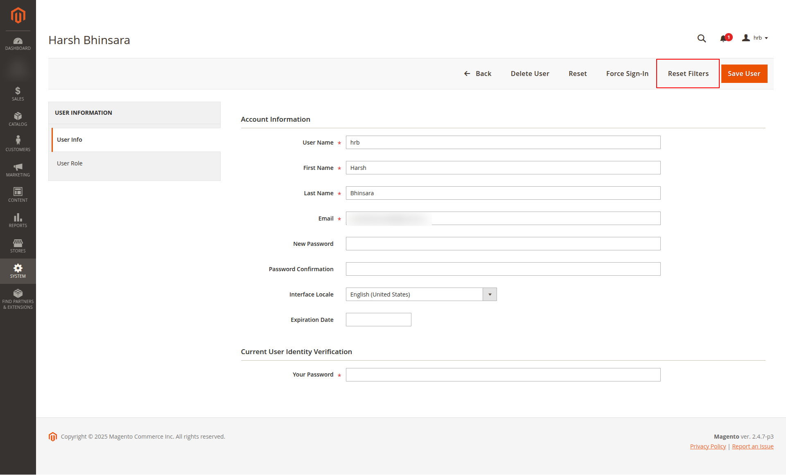

# Hrb_ResetUserFilters - Magento 2 Module
A Magento 2 admin module that adds a "Reset Filters" button to the user edit page under **System > All Users**. This button allows administrators to reset saved grid filters for a specific user, preventing UI errors caused by corrupted `ui_bookmarks` entries.

## Overview

Magento admin users occasionally experience an issue on the **Sales Order Grid** or somewhere else where they receive the error:

> “Something went wrong with processing the default view and we have restored the filter to its original state.”

This error leads to an endless loading screen, preventing users from accessing the order grid. The root cause is corrupted filter data stored in the `ui_bookmarks` table.

### **Solution**
The `Hrb_ResetUserFilters` module adds a **"Reset Filters"** button to the Magento Admin under:
- **System > All Users > Edit User Page**

Clicking this button will remove the affected user's `ui_bookmarks` entry, restoring their access to the grid without manually modifying the database.

## Features

- Adds a **"Reset Filters"** button to each admin user's edit page.
- Clears only the selected user's `ui_bookmarks` entry.
- Prevents UI errors from corrupted saved filters.
- Eliminates the need for direct database modifications.

## Requirements

- Magento 2.3.x or later.
- PHP 7.9 or later.

## Installation

### **1. Download the Extension**

Clone the repository into the `app/code/Hrb/ResetUserFilters` directory of your Magento 2 installation.

```bash
cd /path/to/your/magento/root
git clone https://github.com/HRBHINSARA/m2-pagebuilder-faq.git app/code/Hrb/ResetUserFilters
```

### **2. Enable the Module**

Run the following commands to enable the module:

```bash
php bin/magento module:enable Hrb_ResetUserFilters
php bin/magento setup:upgrade
php bin/magento setup:di:compile
php bin/magento cache:clean
```

## Usage

1. Navigate to **System > All Users** in the Magento Admin Panel.
2. Select a user who is experiencing the grid filter issue.
3. Click **"Reset Filters"** on the user edit page.
4. The system will remove the saved `ui_bookmarks` entry for that user.

## Screenshot


## License
This project is licensed under the MIT License.

## Contributing

If you would like to contribute to this extension, feel free to fork the repository, make changes, and submit a pull request. Please ensure that all code follows Magento 2’s coding standards and that tests are included for any new features.

## Author
Developed by **[Harh Bhinsara]**